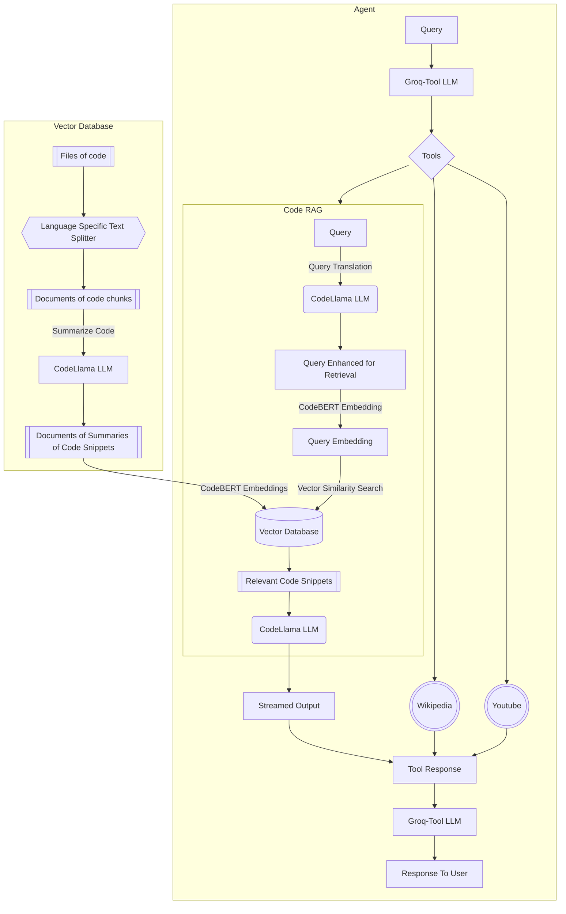

# About
RAG + Agent for answering questions on a codebase. This repository contains the code to ask questions about your codebase entirely locally. This application uses the code Llama and llama3-groq-with-tool-use using ollama running locally on your device. The codebase is embedded using the codeBert embedding model that is downloaded from HuggingFace. The RAG application retrieves the relevant code snippets using FAISS vector store. The code Llama model will generate a response using the retrieved contexts. The agent used is llama3 groq with tool use. The agent can provide the user with links to relevant youtube videos and wikipedia summaries for general programming questions. The agent also has access to the RAG application to answer questions about the codebase.


# Instructions
1. If Ollama is not installed, install it [here](https://ollama.com/download)
2. Open your terminal and run 
```
ollama run codellama
```
3. In a new window in your terminal run 
```
ollama run llama3-groq-tool-use
```
4. It is recommened to use [Rye](https://rye.astral.sh/) to create the environment but pip can be used \
Rye:
```
rye sync 
```
Pip:
```
pip install -r requirements.lock
```
5. Enter the Code-Chat direcotry and start the app: \
Streamlit:
```
streamlit run app.py
```
OR
Terminal:
```
python main.py
```
# Architecture

# Limitations
- There is no codeLLama model that is trained to use tool. The result of using llama3-groq-with-tool-use is less detailed code explanations and decreased explanation of coding concepts
- Retrieving only code snippets lacks significant contexts and relationships in the codebase. This leads to incorrect snippets retrieved or insufficient context for questions on the overall codebase. This applications works well only for questions on parts of the codebase

# Future Work
- Build custom parser to create a Abstract Syntax Tree (AST) for React.js codebases
- Implement a knowledge graph using the AST to retrieve relevant contexts
# Relevant Papers
- Improving Tool Retrieval by Leveraging Large Language Models for Query Generation [https://arxiv.org/html/2412.03573v1]
- 
