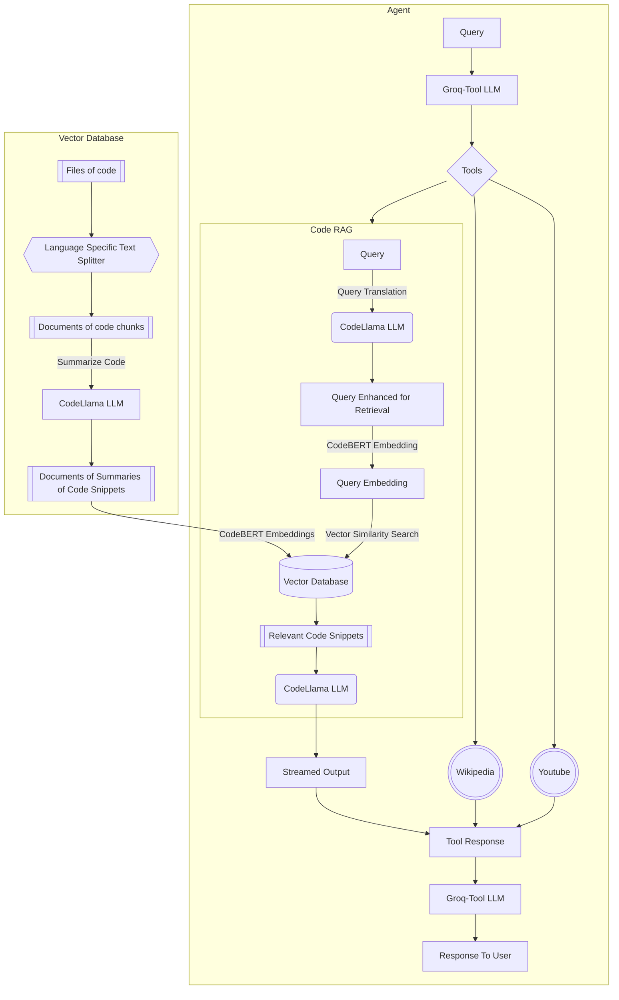

# Code-Chat
RAG on codebase for question answering

# Architecture

# Relevant Papers
- Improving Tool Retrieval by Leveraging Large Language Models for Query Generation [https://arxiv.org/html/2412.03573v1]
- 
## Left to do